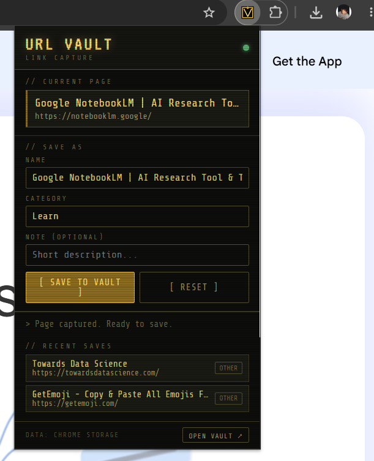
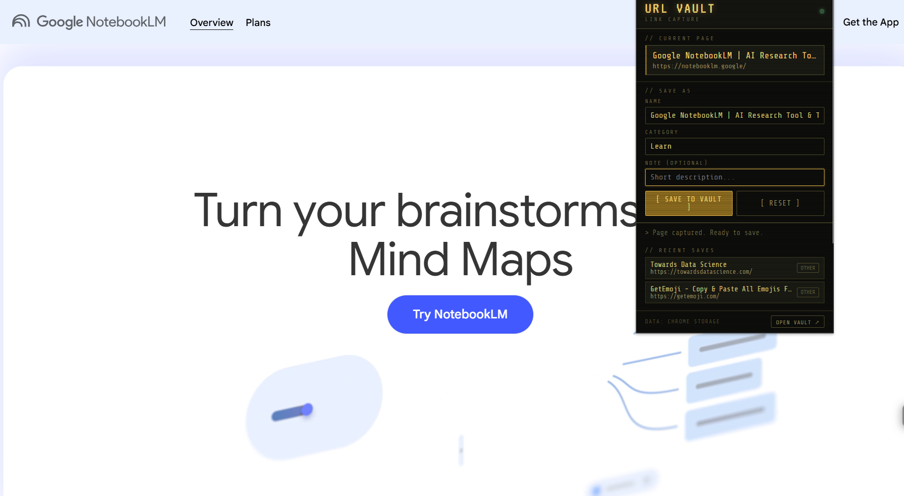

<div align="center">

# 🔐 URL Vault

### Save any webpage in one click. Search it later. Own your data forever.

[](../../releases)
[](manifest.json)
[](popup.js)
[](#architecture)
[](#tech-stack)
[](LICENSE)

<br/>

> **"I kept re-Googling URLs I had already found. So I built the fix."**

<br/>

| Popup on any page | Extension in action |
|:---:|:---:|
|  |  |
| *Click the icon — title & URL captured instantly* | *Works on any webpage, overlays cleanly* |

</div>

---

## Demo

> Watch URL Vault capture a page, auto-categorise it, and save it to the vault in under 3 seconds.

https://github.com/YOUR_USERNAME/url-vault-extension/assets/demo.mp4

> **Can't play the video?** Download it from [`assets/demo.mp4`](assets/demo.mp4) or view the screenshots above.

---

## The Problem

Browser bookmarks are a graveyard. You save things, you never find them again.

```
Typical workflow (broken):
─────────────────────────────────────────────────────────────
  Monday    → Found a great article. Didn't bookmark it.
  Tuesday   → Tried to find it. Spent 12 mins Googling.
  Wednesday → Gave up. Asked a colleague. They sent it on WhatsApp.
  Thursday  → Sent a URL to yourself on Telegram to "save it".
  Friday    → Telegram is not a bookmark manager.
─────────────────────────────────────────────────────────────
Sound familiar?
```

**Root cause:** The standard Chrome bookmark flow requires 4 steps. Nobody consistently does 4 steps. So people don't save — and then they re-find.

---

## The Solution

**URL Vault** is a Chrome extension + full web app that captures the current tab in **one click** — pre-filled, auto-categorised, instantly searchable.

```
New workflow (fixed):
─────────────────────────────────────────────────────────────
  See page → Click icon → Hit Save → Done  (under 3 seconds)
─────────────────────────────────────────────────────────────
```

---

## UI Walkthrough

### The Popup

When you click the URL Vault icon in your Chrome toolbar, the popup opens and immediately shows you the current page — title pre-filled, category auto-detected, ready to save.


**What you're seeing:**

| Element | What it does |
|---|---|
| `// CURRENT PAGE` | Live read of the active tab — title + URL captured automatically |
| `NAME` field | Pre-filled with the page title. Edit it if you want a shorter name. |
| `CATEGORY` | Auto-detected from the URL pattern. Google NotebookLM → **Learn** |
| `NOTE` | Optional. Add context you'll thank yourself for later. |
| `[ SAVE TO VAULT ]` | One click. Saves instantly to `chrome.storage.local`. |
| `// RECENT SAVES` | Last 6 saved entries, visible without opening the vault |
| `OPEN VAULT ↗` | Opens the full searchable vault as a Chrome tab |
| `●` green dot | Extension is active and reading the current tab |

### The Extension Overlaid on a Real Page

URL Vault works on any webpage — here it's open on Google NotebookLM, detecting it as a **Learn** category site.


Notice the auto-categorisation: the extension parsed `notebooklm.google` and the page title "AI Research Tool" and correctly classified it as **Learn** — no manual selection needed.

---

## How It Works

### 1. Click the extension on any page

The popup opens and **instantly reads** the active tab's title and URL via `chrome.tabs` API. Zero typing required.

```js
// popup.js — capturing the current tab
const [tab] = await chrome.tabs.query({ active: true, currentWindow: true });
currentUrl  = tab.url;
currentName = tab.title;

// Auto-detect category from URL pattern
function guessCategory(url, title) {
  const u = (url + title).toLowerCase();
  if (/github|figma|notion|jira|vercel|notebooklm/.test(u)) return 'learn';
  if (/twitter|linkedin|reddit|youtube/.test(u))             return 'social';
  if (/docs|learn|tutorial|medium|blog/.test(u))             return 'learn';
  if (/mail|drive|meet|zoom|calendar/.test(u))               return 'work';
  return 'other';
}
```

### 2. Review, adjust, save

Name and category are pre-filled. Add an optional note. Hit **[ SAVE TO VAULT ]**.

```js
// Data written directly to chrome.storage.local
const entry = {
  id:   Date.now().toString(36) + Math.random().toString(36).slice(2),
  name: "Google NotebookLM | AI Research Tool",
  url:  "https://notebooklm.google/",
  cat:  "learn",
  note: "AI-powered research assistant",
  date: "2025-06-24"
};

chrome.storage.local.set({ urlvault_v1: [entry, ...existing] });
```

### 3. Open the Vault to find anything

The full vault UI is a searchable, filterable archive. Click **OPEN VAULT ↗** from the popup.

```
VAULT CONTENTS                    STORED: 47  WORK: 12  TOOLS: 18  LEARN: 9

>_ search entries...              [ ALL ] [ WORK ] [ TOOLS ] [ LEARN ] [ SOCIAL ]

01  Google NotebookLM             ↗  ⎘  ✎  ✕
    https://notebooklm.google/    [LEARN] // AI research tool          2025-06-24

02  Towards Data Science          ↗  ⎘  ✎  ✕
    https://towardsdatascience.com [OTHER]                              2025-06-23

03  GetEmoji                      ↗  ⎘  ✎  ✕
    https://getemoji.com/         [OTHER]                              2025-06-23
```

---

## Architecture

```
┌─────────────────────────────────────────────────────────────┐
│                    CHROME BROWSER                           │
│                                                             │
│  ┌──────────────┐         ┌─────────────────────────────┐  │
│  │   POPUP UI   │         │       VAULT WEB APP         │  │
│  │  popup.html  │         │      vault/index.html       │  │
│  │  popup.js    │         │      vault/vault.js         │  │
│  └──────┬───────┘         └──────────────┬──────────────┘  │
│         │                                │                  │
│         │    chrome.storage.local        │                  │
│         └──────────────┬─────────────────┘                  │
│                        │                                    │
│              ┌─────────▼──────────┐                        │
│              │   urlvault_v1      │  ← JSON array          │
│              │   [ entry, ... ]   │  ← persisted locally   │
│              └────────────────────┘                        │
│                                                             │
│  ┌─────────────────────────────────────────────────────┐   │
│  │  chrome.storage.onChanged  →  live sync both UIs    │   │
│  └─────────────────────────────────────────────────────┘   │
└─────────────────────────────────────────────────────────────┘

NO SERVER. NO DATABASE. NO API CALLS. YOUR DATA NEVER LEAVES YOUR MACHINE.
```

### Storage schema

```json
{
  "urlvault_v1": [
    {
      "id":   "lf3k2a9x",
      "name": "Google NotebookLM | AI Research Tool",
      "url":  "https://notebooklm.google/",
      "cat":  "learn",
      "note": "AI-powered research assistant",
      "date": "2025-06-24"
    }
  ]
}
```

### Live sync between popup and vault

Both UIs listen to the same storage key. Save from the popup → vault updates instantly without a page refresh.

```js
// vault.js — real-time sync
chrome.storage.onChanged.addListener(changes => {
  if (changes['urlvault_v1']) render();
});
```

---

## File Structure

```
url-vault-extension/
│
├── manifest.json          # Chrome Extension Manifest V3 config
│                          # Declares permissions: activeTab, storage, tabs
│
├── popup.html             # Extension popup (320px wide)
│                          # Opens when you click the toolbar icon
│
├── popup.js               # Popup logic
│                          # → Reads active tab via chrome.tabs API
│                          # → Auto-guesses category from URL
│                          # → Writes to chrome.storage.local
│                          # → Renders last 6 saved entries
│
├── assets/
│   ├── popup-screenshot.png   # Popup UI screenshot
│   ├── popup-in-action.png    # Extension overlaid on a real page
│   └── demo.mp4               # Full walkthrough video
│
├── icons/
│   ├── icon16.png         # Toolbar icon
│   ├── icon48.png         # Extension management page
│   └── icon128.png        # Chrome Web Store
│
└── vault/
    ├── index.html         # Full vault web app (opens as a tab)
    │                      # Search bar, category filters, entry cards
    │
    └── vault.js           # Vault logic
                           # → Reads from chrome.storage.local (async)
                           # → Real-time search across name + url + note
                           # → Full CRUD: create, read, update, delete
                           # → Event delegation (CSP-compliant, no inline handlers)
                           # → Live sync via storage.onChanged
```

---

## Tech Stack

| Layer | Choice | Why |
|---|---|---|
| Language | Vanilla JS | No build step, no dependencies, ships as-is |
| Extension API | Chrome Manifest V3 | Current standard, required for Web Store |
| Storage | `chrome.storage.local` | Shared between popup + vault, persists across sessions |
| Styling | Pure CSS + Google Fonts | No framework needed for this scope |
| Security | CSP-compliant | No inline scripts, no `onclick=` attributes, all via `addEventListener` |
| Architecture | Local-first | Zero network calls, works offline, user owns their data |

---

## Security & Privacy

This extension requests **3 permissions** only:

```json
"permissions": ["activeTab", "storage", "tabs"]
```

| Permission | What it does | Why needed |
|---|---|---|
| `activeTab` | Read the current tab when popup is open | Capture URL + title |
| `tabs` | Query the active tab | Same as above |
| `storage` | Read/write `chrome.storage.local` | Save and load your vault |

**No** network requests. **No** analytics. **No** external servers. **No** cookies.
You can verify this by inspecting the source — there are zero `fetch()` or `XMLHttpRequest` calls anywhere.

---

## Install

### Option A — Chrome Web Store *(coming soon)*

One-click install, no developer mode needed.

### Option B — Manual (available now)

```bash
# 1. Download the zip from the Releases tab above
# 2. Unzip it

# 3. Open Chrome and navigate to:
chrome://extensions

# 4. Toggle "Developer mode" ON (top-right corner)

# 5. Click "Load unpacked" → select the url-vault-extension folder

# 6. Pin the extension to your toolbar for quick access
```

---

## PM Thinking Behind This Build

This was built **backwards from a frustration**, not forward from a technology.

| | |
|---|---|
| **Pain point** | Re-finding URLs already visited costs 15–20 min/week per knowledge worker |
| **Root cause** | 4-step bookmark flow → nobody saves → people re-find manually |
| **Real competitor** | Sending URLs to yourself on WhatsApp (this is the baseline behaviour) |
| **User need** | Save a URL in under 3 seconds, retrievable without remembering the exact name |
| **Success metric** | Time-to-save < 3 sec · Zero re-Googling · No friction at point of save |
| **MVP decision** | One-click capture + search. Deliberately excluded tags, folders, sync |

---

## Roadmap

- [ ] Chrome Web Store public listing
- [ ] Keyboard shortcut to save without opening popup (`Ctrl+Shift+S`)
- [ ] Tag support — multiple tags per entry
- [ ] Export vault to CSV / JSON
- [ ] Import from Chrome bookmarks
- [ ] Firefox port (WebExtensions API compatible)
- [ ] Fuzzy search

---

## Contributing

Found a bug or have a feature idea? Open an issue — PRs welcome.

```bash
git clone https://github.com/YOUR_USERNAME/url-vault-extension.git
cd url-vault-extension
# Load in Chrome via chrome://extensions → Load unpacked
# Make changes → Reload extension → Test
```

---

<div align="center">

Built by **Anuj** · Engineering graduate → Product Manager

*If this saved you time, a ⭐ on the repo goes a long way.*

[](www.linkedin.com/in/anujbhaisal03)
[](https://github.com/anujCodex7)

</div>
